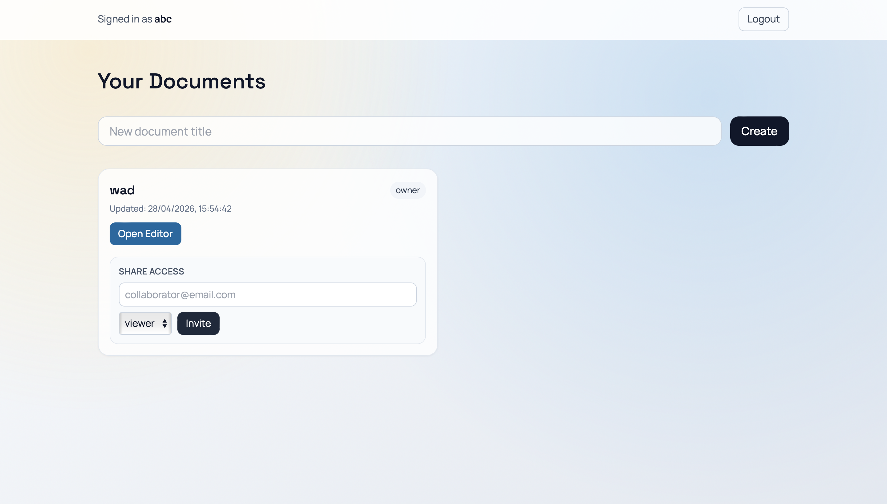

# MERN Realtime Collaboration Platform

Production-grade realtime collaborative editor built with Express, Socket.IO, MongoDB, Yjs, React, and TipTap.

## What Is Implemented

This codebase now includes all major upgrade phases requested:

- Frontend completion with routing, auth screens, documents dashboard, and TipTap editor
- Efficient Yjs synchronization using state vectors and diff updates
- Horizontal scaling support with Redis Socket.IO adapter plus replicated Yjs updates
- JWT authentication and document-level authorization (owner/editor/viewer)
- API and socket rate limiting, payload guards, and hardened HTTP middleware
- Y.Doc lifecycle cleanup and in-memory leak protection
- Backend API and socket test setup using Jest + Supertest + mongodb-memory-server
- Optional document snapshot endpoint while keeping CRDT as primary sync path

## Screenshots

### 1. Login & Registration

Users can register new accounts or sign in with existing credentials.

### 2. Documents Dashboard

View all your documents, create new ones, and manage document access (owner/editor/viewer roles).

### 3. Real-time Document Editor

Collaborate with others in real-time. See live cursor positions, presence indicators, and synchronized edits powered by Yjs.

## Architecture

### Backend

- Express API server and Socket.IO server bootstrap: backend/app.js
- Startup entrypoint: backend/server.js
- Mongo connection: backend/utils/db.js
- CRDT document manager: backend/utils/docManager.js
- Collaboration socket protocol: backend/sockets/collabSocket.js
- Redis scaling + Yjs replication bus: backend/utils/redis.js
- Auth middleware (HTTP + socket):
  - backend/middleware/requireAuth.js
  - backend/middleware/socketAuth.js
- Security middleware:
  - backend/middleware/httpSecurity.js
  - backend/utils/socketRateLimiter.js

### Frontend

- Root app and routes: frontend/App.jsx
- Auth context and session storage: frontend/context/AuthContext.jsx
- Authenticated socket context: frontend/context/SocketContext.jsx
- Pages:
  - frontend/pages/LoginPage.jsx
  - frontend/pages/RegisterPage.jsx
  - frontend/pages/DocumentListPage.jsx
  - frontend/pages/EditorPage.jsx
- Protected route wrapper: frontend/components/ProtectedRoute.jsx
- API client and endpoints: frontend/services/api.js

## Core Flows

### 1) Authentication and Authorization

- Register/login return JWT access token
- Token is required for:
  - all /documents REST endpoints
  - socket handshake connection
- Document permissions:
  - owner: full control, can share
  - editor: can edit over socket
  - viewer: read-only access

### 2) Efficient Yjs Sync (Diff-based)

On room join:
1. Client sends current state vector
2. Server computes missing update with:
   - Y.encodeStateAsUpdate(serverDoc, clientStateVector)
3. Server returns only missing update + server state vector
4. Client can optionally send back missing server-side data using server state vector

This avoids full-state transfer for reconnects and stale clients.

### 3) Awareness API (Cursor/Presence)

- Presence is synchronized using Yjs Awareness updates
- Awareness updates are broadcast as binary diffs
- Replaces the previous custom cursor payload model

### 4) Multi-instance Scaling

When ENABLE_REDIS=true:
- Socket.IO uses Redis adapter for cross-node rooms/events
- Yjs updates are published to Redis channel and applied on sibling nodes
- Keeps in-memory CRDT state coherent across instances that host active participants

## Security and Abuse Protection

- helmet-enabled HTTP hardening
- Express rate limits:
  - global API limiter
  - stricter auth limiter
- Socket event rate limiter (per socket + event window)
- yjs-update payload byte limit
- awareness-update payload byte limit
- title/email sanitization and document ID validation

## Memory Safety

- Y.Doc state stored only for active rooms
- Final save on last participant leave
- Debounce timer cancellation on cleanup
- Recent hash eviction timers tracked and cleared
- Socket counters cleared on disconnect

## REST API

### Auth

- POST /auth/register
- POST /auth/login
- GET /auth/me

### Documents (JWT required)

- GET /documents
- POST /documents
- GET /documents/:id
- POST /documents/:id/share
- GET /documents/:id/snapshot

## Socket Events

JWT token must be sent in handshake auth:

- Client -> server
  - join-room: { docId, user, stateVector }
  - leave-room: { docId }
  - yjs-update: { docId, update }
  - awareness-update: { docId, update }

- Server -> client
  - yjs-update: { docId, update }
  - awareness-update: { docId, update, socketId }
  - presence-update: { docId, type, socketId, users }

join-room ack includes:
- ok
- role
- update (missing server diff)
- serverStateVector
- users

## Environment Variables

### backend/.env

Copy from backend/.env.example:

- PORT=5000
- MONGODB_URI=mongodb://127.0.0.1:27017/collab_platform
- CLIENT_ORIGIN=http://localhost:5173 (comma-separated domains supported)
- JWT_SECRET=replace_with_a_strong_secret
- JWT_EXPIRES_IN=7d
- ENABLE_REDIS=false
- REDIS_URL=redis://127.0.0.1:6379
- YJS_REDIS_CHANNEL=collab:yjs:update
- SERVER_ID=server-1
- API_RATE_LIMIT_WINDOW_MS=900000
- API_RATE_LIMIT_MAX=300
- AUTH_RATE_LIMIT_WINDOW_MS=900000
- AUTH_RATE_LIMIT_MAX=30
- SOCKET_RATE_WINDOW_MS=10000
- SOCKET_RATE_MAX_EVENTS=120
- MAX_YJS_UPDATE_BYTES=262144
- MAX_AWARENESS_UPDATE_BYTES=32768
- MAX_JSON_BODY=1mb

### frontend/.env

Copy from frontend/.env.example:

- VITE_API_BASE_URL=http://localhost:5000 (or leave empty for same-origin proxy)
- VITE_SOCKET_URL=http://localhost:5000 (or leave empty for same-origin proxy)
- VITE_API_TIMEOUT_MS=10000

## Local Development

Prerequisites:
- Node.js 18+
- MongoDB running locally
- Redis (optional, only for multi-instance testing)

Install dependencies:

```bash
cd backend
npm install

cd ../frontend
npm install
```

Run backend:

```bash
cd backend
npm run dev
```

Run frontend:

```bash
cd frontend
npm run dev
```

Health check:

```bash
curl http://localhost:5000/health
```

## Hosting (Docker Compose)

This repository includes production container configs for frontend, backend, MongoDB, and Redis:

- backend/Dockerfile
- frontend/Dockerfile
- frontend/nginx.conf
- docker-compose.yml

Recommended deploy flow:

1. Copy .env.hosting.example to a root-level .env file and set values for your domain and JWT secret.
2. Build and start all services:

```bash
docker compose up -d --build
```

3. Open the app at http://localhost (or your mapped domain).

4. Verify health endpoint through frontend proxy:

```bash
curl http://localhost/health
```

Notes:

- Frontend Nginx proxies /auth, /documents, /health, and /socket.io to backend.
- Redis is included but only used when ENABLE_REDIS=true.
- For cloud production, use managed MongoDB/Redis and expose only the frontend entrypoint.

## Test Setup

Backend tests are configured with Jest.

Run tests:

```bash
cd backend
npm test
```

Included tests:
- API auth/document lifecycle tests
- Basic socket collaboration event tests

## Multi-instance Deployment (Redis)

Set in backend .env:

- ENABLE_REDIS=true
- REDIS_URL=<your redis url>
- SERVER_ID=<unique id per node>

Run multiple backend instances behind a load balancer with sticky sessions recommended.

Example process-level ports:

```bash
# node 1
PORT=5001 SERVER_ID=node-1 ENABLE_REDIS=true npm start

# node 2
PORT=5002 SERVER_ID=node-2 ENABLE_REDIS=true npm start
```

Frontend should point to load balancer URL via VITE_API_BASE_URL and VITE_SOCKET_URL.

## Edge Cases Addressed

- Duplicate socket room join requests are idempotent
- Reconnect with stale state uses state-vector diff sync
- Malformed/stale state vectors gracefully fall back to full-state sync on join
- Duplicate Yjs updates are hash-deduplicated
- Partial updates are CRDT-merged safely
- Server restart recovers document state from MongoDB
- Concurrent edits are conflict-free through Yjs CRDT merge

## Notes

- CRDT (Yjs) remains the primary source of truth for realtime content synchronization
- Snapshot endpoint is optional and does not replace CRDT live sync
- For production, use strong JWT secrets, TLS, and managed MongoDB/Redis
